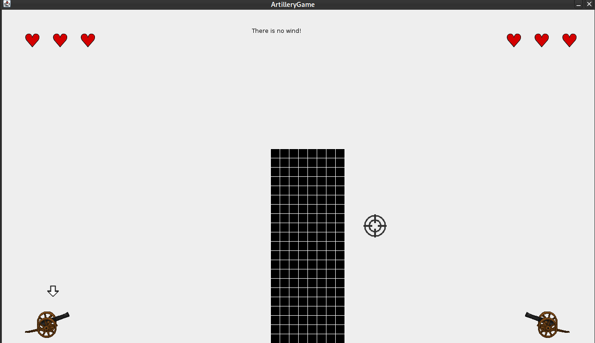
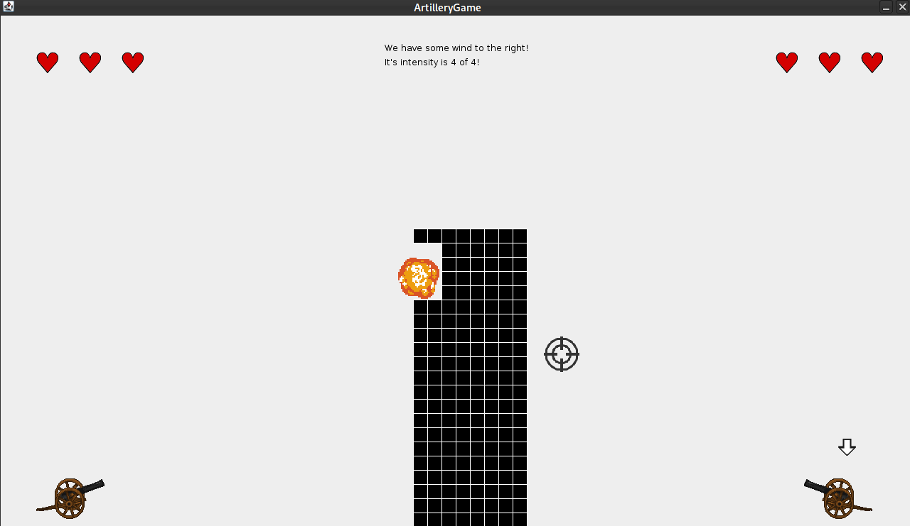
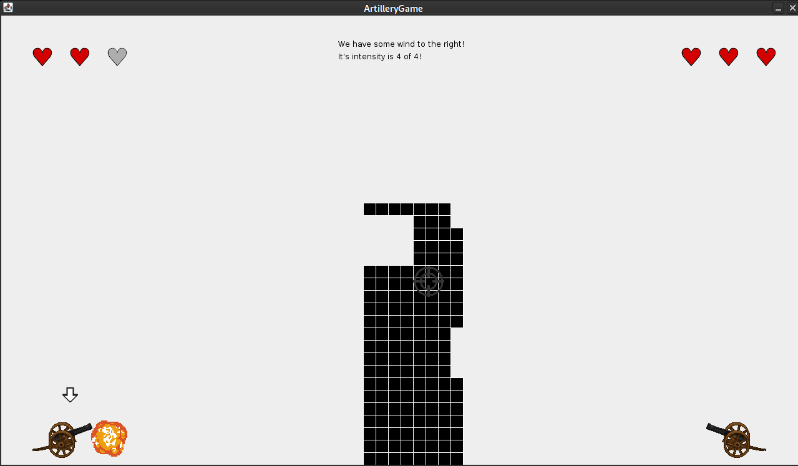
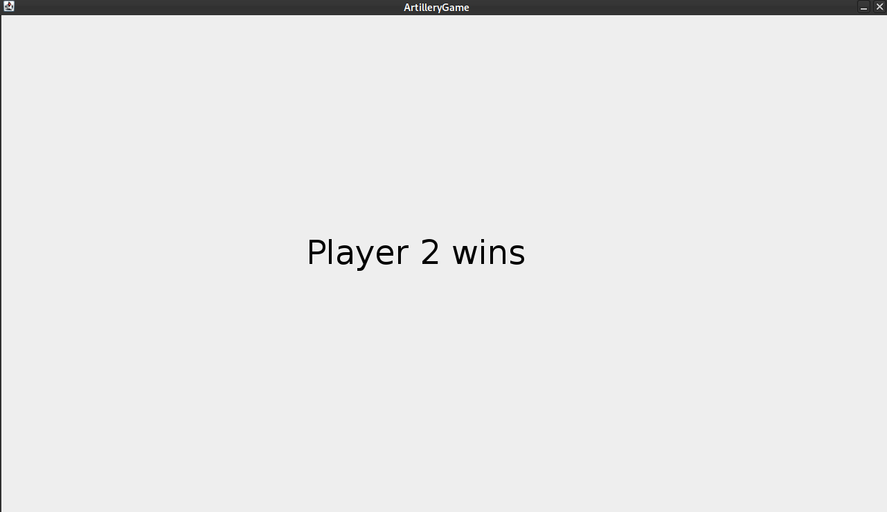

# Studienleistung 3

## Wichtige Informationen zur Bearbeitung der Aufgabe 
  - [Informationen zur Entwicklungsumgebung *IntelliJ IDEA*](https://elearning.uni-regensburg.de/mod/book/view.php?id=1480675)
  - [Informationen zum Im- und Export von Projekten](https://elearning.uni-regensburg.de/mod/book/view.php?id=1480675&chapterid=51551)
  - [GraphicsApp](https://elearning.uni-regensburg.de/mod/url/view.php?id=1482162)

## Starterpaket

Ein vorbereitetes Starterpaket zur selbständigen Implementierung der Aufgabe finden Sie [hier](https://github.com/OOP-Ubungen-WS2020-21/U00-Template-fuer-Aufgaben/archive/Starterpaket.zip).

## ArtilleryGame

Im Rahmen dieser Aufgabe entwickeln wir ein Spiel aus dem Genre der [Artillery Games](https://en.wikipedia.org/wiki/Artillery_game). 
[Tank Wars](https://dosgames.com/game/tank-wars/) ist ein Beispiel für ein solches Spiel.
Unser ArtilleryGame bleibt dieser Formel treu und ist demnach auch ein 2-Spieler, rundenbasiertes Strategiespiel.

{ width=50% }

Auf GRIPS finden sie zusätzlich ein kleines [Demo-Video](https://elearning.uni-regensburg.de/mod/resource/view.php?id=1596083), das den allgmeinen Spielablauf zeigt.

### Beschreibung
Auf der jeweils linken und rechten Seite des Spielfeldes befinden sich zwei Kanonen, stellvertretend für Spieler:in 1 (linke Kanone) und Spieler:in 2 (rechte Kanone).
Wessen Zug es gerade ist, wird durch den weißen Pfeil über der entprechenden Kanonene angezeigt.
Die beiden Kanonen sind anhand von Terrain von einander getrennt.
Diese Terrain kann durch explodierende Kanonenkugeln zerstört werden.
Spieler:innen benutzen Tastatur und Maus, um ihre Kanone zu bewegen (Tastatur, A für Linksbewegung, D für Rechtsbewegung), mit einem Fadenkreuz zu zielen (Maus) und einen Schuss abzugeben (Maus, linke Maustaste).
Spieler:innen haben genau einen Schuss pro Runde.
Dieser Schuss beendet den Zug und die andere Person ist dran mit ihrem Zug.
Die abgefeuerte Kanonenkugel wird von Gravitation und Wind beeinflusst.
Wind kommt in unterschiedlichen Facetten vor - kein Wind, Windstärke 1, 2, 3 und 4.
In den oberen Ecken oberhalb der Kanonen ist deren Gesundheitsanzeige in Form von drei roten Herzen.
Wird eine Kanone von einer Kanonenkugel getroffen, färbt sich das rechteste rote Herz grau.
Sind alle Herzen grau bzw. wird eine Kanone dreimal getroffen, gewinnt die Person, die den Schuss abgegeben hat, das Spiel.
Dies wird den Spieler:innen anhand eines Game-Over-Sreens angezeigt.
Das Spiel startet neu, wenn man in diesem Game-Over-Screen die linke Maustaste drückt.
Das Spiel beinhaltet eine sich wiederholende Hintergrundmusik und Sounds, die abgespielt werden sollen, wenn eine Kanone abgefeuert wird und eine Kanonenkugel etwas trifft (z.B. Kartenrand, Kanone, Terrain).
Alle benötigten Assets finden Sie im Ordner `data/assets` innerhalb des Starterpakets.

### Weitere Screenshots

 { witdth=50% }

{ width=50% }

{ width=50% }

{ width=50% }

### Anforderungen
* Die Klasse `ArtilleryGame` muss als Einstiegspunkt für Ihr ArtilleryGame verwendet werden
* Teilen Sie Ihre Anwendung in sinnvolle Komponenten ein und legen Sie entsprechende Klassen dafür an
* Trennen Sie die Daten von Objekten (z.B. Kanonen) von deren Darstellung
* Teilen Sie das ArtilleryGame in konkrete Teilaspekte ein, z.B.:
  * Szenen (Spiel, Game Over)
  * Spielobjekte ([Actorprinzip](https://gamedev.stackexchange.com/questions/151169/what-is-an-actor-in-game-development#:~:text=A%20game%20actor%20is%20an,might%20even%20be%20an%20actor.), z.B. Kanonen, Terrain)
* Zerlegen Sie das Spiel in konkrete Phasen und Phasenübergänge.
* Implementieren Sie die notwendigen Kollisionsabfragen
* Verwenden Sie sinnvolle Datenstrukturen (z.B. `ArrayList`)
* Praktizieren Sie `Decomposition`

### Hinweise

#### Berechnung der Schussrichtung
* Die Schussrichtung muss als zweidimensionaler Richtungsvektor berechnet werden, um die korrekten x- und y-Koordinaten für die Kanonenkugel pro Frame berechnen zu können
* Die Schussrichtung wird durch zwei Punkte definiert: die Mündung des Kanonenrohrs und dem von den Spieler:innen bewegbaren Fadenkreuz
* Bei Mausklick soll anhand dieser Richtung ein Richtungsvekor berechnet werden
* Verwenden Sie folgenden Code für die Berechnung (tauschen Sie Platzhalter entsprechend aus):

```java
private Point calculateShotDirection() {
    Point barrelPosition 
    	= new Point(<x-Koordinate der Kanonenmündung>, <y-Koordinate der Kanonenmündung>);
    
    Point crosshairPosition = new Point(<x-Koordinate des Mittelpunkts des Fadenkreuzes>,
    	<y-Koordinate des Mittelpunkts des Fadenkreuzes>);
    
    float directionX = crosshairPosition.getXPos() - barrelPosition.getXPos();
    float directionY = crosshairPosition.getYPos() - barrelPosition.getYPos();
    
    Point directionVector = new Point(directionX, directionY);
    
    float directionXSquared = directionVector.getXPos() * directionVector.getXPos();
    float directionYSquared = directionVector.getYPos() * directionVector.getYPos();

    double directionVectorLength = sqrt(directionXSquared + directionYSquared);
    
    float normalizedDirectionX = v.getXPos() / directionVectorLength;
    float normalizedDirectionY = v.getYPos() / directionVectorLength;
    
    Point normalizedDirectionVector 
    	= new Point(normalizedDirectionX, normalizedDirectionY);

    return normalizedDirectionVector;
}

```

#### Integration von Sound, Maus und Keyboard
* Verwenden Sie die Klasse [`AudioClip`](https://oop-regensburg.github.io/GraphicsApp-Reborn-Library/html/classde_1_1ur_1_1mi_1_1oop_1_1audio_1_1_audio_clip.html), um Sounds in ihr Spiel zu integrieren
* Überschreiben Sie die Methoden (`@Override`):
  * `public void onMousePressed(MousePressedEvent event);`, um Klickevents der linken Maustaste abzufangen
  * `public void onMouseMoved(MouseMovedEvent event);`, um die Position des Mauscursors zu erhalten und das Fadenkreuz korrekt zu platzieren
  * `public void onKeyPressed(KeyPressedEvent event);`, um 
  
#### Kollisionsabfragen
* Objekte der Klasse [`GrahpicsObject`](https://oop-regensburg.github.io/GraphicsApp-Reborn-Library/html/classde_1_1ur_1_1mi_1_1oop_1_1graphics_1_1_graphics_object.html), z.B. `Image`, `Rectangle` oder `Circle` erben von `GraphicsObject`, haben die Methode `public boolean hitTest(float x, float y);` ([Dokumentation](https://oop-regensburg.github.io/GraphicsApp-Reborn-Library/html/classde_1_1ur_1_1mi_1_1oop_1_1graphics_1_1_graphics_object.html#aa058c4daea042244726ae347972511ae))
* Benutzen Sie diese Methode, um Kollisionsabfragen der einzelnen Spielobjekte (Actors) zu implementieren

### Mögliche Erweiterungen
* Hübschere Darstellung der Windrichtung und -stärke
* Verschiedene Munitionstypen (schwerer, aber größere Explosion, etc.) 
* Hauptmenü

